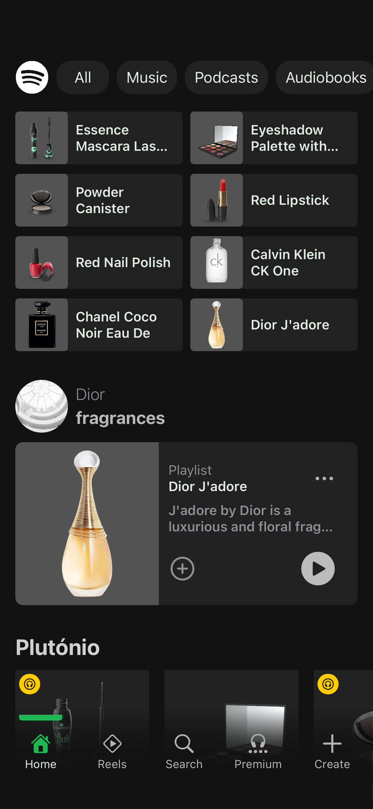
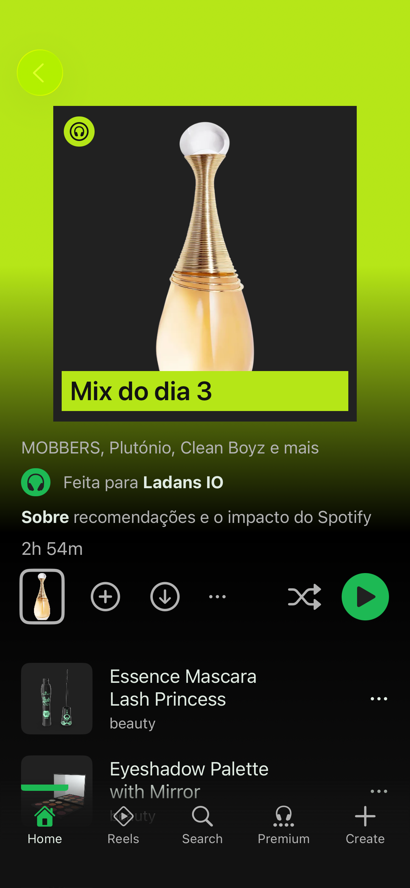
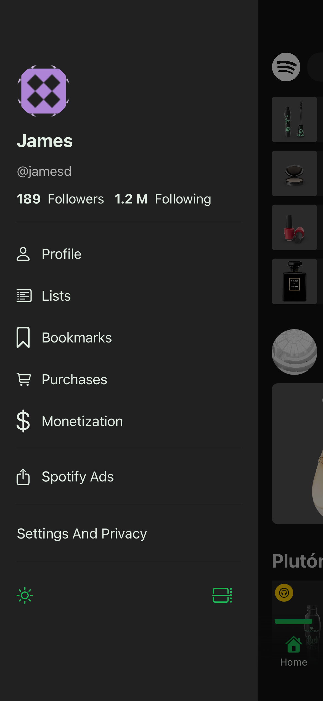
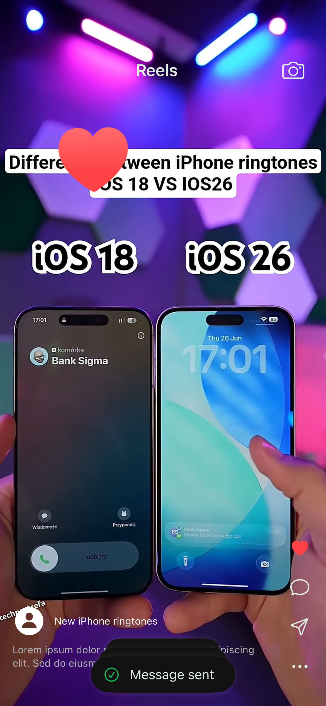

# 🎧 SwiftUI Spotify Clone and More... — Advanced UI & Networking

An advanced **SwiftUI** project that started as a simple **Spotify UI clone** but evolved into a fully customized and animated application.
This project demonstrates modern SwiftUI techniques, reusable components, smooth animations, and a **clean networking layer** with `URLSession` abstraction.

---

## ✨ Features

* 🎨 **Custom Spotify-inspired UI** — built entirely with SwiftUI.
* 🌀 **Smooth Animations** — interactive transitions and view animations.
* 📹 **Reels-like Section** — vertical videos with smooth scrolling.
* 📌 **Custom Side Menu** — animated drawer with gesture support.
* 🔔 **Custom Toasts & Alerts** — reusable notification components.
* 🗂 **Custom Tab Views** — dynamic tabs with custom animations.
* 🚀 **Animated Splash Screen** — fully custom startup animation.
* 🌐 **Networking Layer** — clean `URLSession` abstraction with async/await.

---

## 🛠️ Tech Stack

* **Language:** Swift 5.10+
* **Framework:** SwiftUI
* **Architecture:** MVVM + Dependency Injection
* **Networking:** URLSession abstraction with async/await
* **Minimum iOS:** 16.0

---

## 📱 Screenshots

| Splash Screen | Home Screen | Detail Screen | Side Menu Section | Reels Menu |
| ------------- | ----------- | ------------- | ----------------- | ---------- |
|  |  |  |  |  |

---

## 🧩 Project Structure

```
SpotifySwiftUI/
├── App/           # App entry point, environment setup, dependencies
├── Core/          # Core services, constants, utilities
├── Features/      # Feature-based modules (scalable architecture)
│   ├── Home/      # Home screen + components
│   ├── Premium/   # Premium subscription section
│   ├── Product/   # Product details, UI and logic
│   ├── Reel/      # Reels-style vertical video section
│   ├── Search/    # Search UI and logic
│   ├── Splash/    # Animated splash screen
│   └── User/      # User profile and settings
├── Resources/     # Assets, colors, fonts, images
├── Shared/        # Reusable components (toasts, buttons, modals, etc.)
├── SideMenu/      # Custom animated side menu
├── TabView/       # Custom tab bar with animations
└── Info/          # App Info.plist and configs

```

---

## 🌐 Networking Layer

This project uses a **clean and reusable networking layer** based on **URLSession abstraction**.
It supports:

* ✅ Custom HTTP methods (`GET`, `POST`, `PUT`, `DELETE`)
* ✅ Custom headers and body requests
* ✅ Async/await integration
* ✅ Type-safe JSON decoding

### 1. HTTP Method

```swift
enum HttpMethod: String {
    case POST, PUT, GET, DELETE
    
    var method: String {
        rawValue
    }
}
```

---

### 2. Error/Failure

```swift
enum Failure: Error {
    case server(code: Int? = nil, error: Error? = nil),
         cache(message: String)
    
    var message: String {
        switch self {
        case .server(code: let code, error: let error):
            if error == nil {
                switch code {
                case 400:
                    return "Bad Request"
                case 403:
                    return "Forbidden"
                case 404:
                    return "Not Found"
                case 0:
                    return "Unknown Error"
                default:
                    return "Server Error"
                }
            }
            
            return error!.localizedDescription
            
        case .cache(message: let message):
            return message
        }
    }
}
```

---

### 3. NetworkRequest Protocol

```swift
struct HttpRequest: Sendable {
    let baseURL: String
    
    var request: URLRequest {
        URLRequest(url: URL(string: baseURL)!)
    }
    
    init(baseURL: String) {
        self.baseURL = baseURL
    }
}

extension HttpRequest {
    func path(_ path: String) -> URLRequest {
        var req = request
        req.url = req.url!.appendingPathComponent(path)
        return req
    }
}

extension URLRequest {
    func method(_ method: HttpMethod) -> URLRequest {
        var req = self
        req.httpMethod = method.method
        return req
    }
    
    func body(_ body: Data?) -> URLRequest {
        var req = self
        req.httpBody = body
        return req
    }
    
    func headers(_ headers: Dictionary<String, String>) -> URLRequest {
        var req = self
        for (key, value) in headers {
            req.setValue(value, forHTTPHeaderField: key)
        }
        return req
    }
}
```

---

### 4. URLSession Abstraction

```swift
class HttpClient: HttpClientProtocol {
    func send<T: Codable>(_ request: URLRequest, responseType: T.Type) async -> Either<T> {
        do {
            let (data, response) = try await URLSession.shared.data(for: request)
            
            if !data.isEmpty {
                let result = try JSONDecoder().decode(T.self, from: data)
                return (nil, result)
            }
            
            if let httpResponse = response as? HTTPURLResponse {
                return (Failure.server(code: httpResponse.statusCode), nil)
            }
            
            return (Failure.server(code: 0), nil)
        } catch {
            return (Failure.server(error: error), nil)
        }
    }
}
```

---

### 5. Example API Request

```swift
struct Service {
    let httpClient: HttpClient = HttpClient()
    var request: HttpRequest = HttpRequest(baseURL: "https://dummyjson.com/")
    
    func getProdcuts() async -> Either<ProductArray> {
        return await httpClient.send(
            request
                .path("products")
                .method(.GET),
            responseType: ProductArray.self
        )
    }
}
```

---

### 6. Using It in a ViewModel

```swift
class ProductStore: ObservableObject {
    @Published var products: [Product] = []
    
    init()  {
        Task {
            await getProducts()
        }
    }
    
    private func getProducts() async {
        let (error, result) = await Service().getProdcuts()
        if let productsArray = result {
            products = Array(productsArray.products.prefix(8))
        } else if let error = error {
            print("Failed to fetch products: \(error.message)")
        }
    }
}
```

---

## 🚀 Getting Started

### 1. Clone the Repository

```bash
git clone https://github.com/lad-ans/SpotifySwiftUI.git
cd SpotifySwiftUI
```

### 2. Open in Xcode

```bash
open SpotifySwiftUI.xcodeproj
```

### 3. Run the Project

* Select a simulator (iPhone 15 or later recommended)
* Press **Cmd + R**

---

## 📌 Roadmap

* [ ] Dark & Light Mode support
* [ ] Unit tests for networking layer

---

## 🧑‍💻 Author

**Ladino Anselmo (ladans)**
[GitHub](https://github.com/lad-ans) • [LinkedIn](https://www.linkedin.com/in/ladino-anselmo-0b0898231/)

---

## 📜 License

This project is licensed under the **MIT License**.
